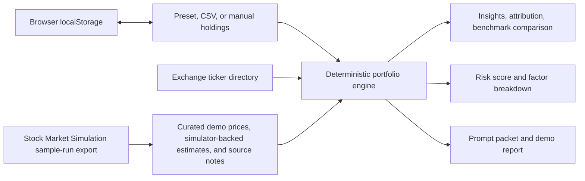

# Portfolio Insight Copilot

A practical AI-focused portfolio explanation prototype tailored for a Charles Schwab technology or data internship portfolio.

The app helps a retail investor understand what changed in a demo portfolio by combining:

- Portfolio movement calculations
- Holding-level and sector-level context
- Citation-backed source snippets
- Non-advisory guardrails
- Explanation depth controls
- A simple CSV upload path for custom demo portfolios
- Manual ticker search and add flow for users who do not want to upload CSV files
- A dedicated Build Portfolio tab for add, edit, delete, and risk review workflows
- A Demo Guide tab with a one-click scenario, guardrail example, and copyable report
- Browser-only portfolio saving with `localStorage`
- Simulation-backed benchmark comparison against SPY, plus static QQQ and SCHD comparisons
- Type-aware listed-symbol estimates calibrated from the Stock Market Simulation sample run
- Transparent demo risk score with factor-level breakdown
- Attribution bars and AI readiness checks
- A visible prompt packet showing how retrieved facts would be sent to an LLM

This project is intentionally dependency-free and runs as a static website demo. It does not require a backend, paid APIs, user accounts, or live market-data subscriptions.

## Run It

Open this file in a browser:

```text
C:\Users\tforstrom\Desktop\Portfolio Insight Copilot\index.html
```

No install step is required.

## Project Structure

```text
Portfolio Insight Copilot
+-- index.html
+-- src
|   +-- app.js
|   +-- data.js
|   +-- engine.js
|   +-- styles.css
|   +-- ticker-universe.js
+-- docs
|   +-- ai-system-design.md
|   +-- interview-pitch.md
+-- examples
|   +-- sample-portfolio.csv
+-- tests
    +-- engine-checks.mjs
    +-- ticker-universe-checks.mjs
    +-- ui-demo-checks.mjs
    +-- validation-checklist.md
```

## Validation

If Node is available from the project folder:

```bash
node tests/engine-checks.mjs
node tests/ticker-universe-checks.mjs
node tests/ui-demo-checks.mjs
```

The test file checks CSV parsing, duplicate holding aggregation, unsupported-symbol handling, advice-request detection, zero cost basis handling, and prompt-packet citation coverage.
It also validates manual add, duplicate merge, invalid-share rejection, and remove-holding behavior.
Builder-specific checks cover exact holding edits and AI-style risk review flags.
The UI demo smoke test checks that the Demo Guide tab, one-click scenario, guardrail example, and report preview are present.

## Demo CSV Format

Use the included sample at:

```text
C:\Users\tforstrom\Desktop\Portfolio Insight Copilot\examples\sample-portfolio.csv
```

Or upload a CSV with these headers:

```csv
symbol,shares,costBasis
AAPL,12,165
MSFT,8,388
SCHW,25,73
NVDA,5,875
JPM,10,198
```

Unknown symbols are accepted, but the app will only have curated market context for the included detailed demo symbols.

## Why This Fits Schwab

Schwab has publicly emphasized AI-powered portfolio insights that combine portfolio performance, market news, expert commentary, and human-centered guardrails. This project demonstrates those same product instincts in a compact, interview-friendly implementation.

The project is designed to show:

- Product thinking for retail investors
- Responsible AI behavior in financial services
- Data engineering basics through structured market and portfolio records
- Retrieval-style source grounding and citation UX
- Clear separation between educational explanation and investment advice
- Testable business logic separated from UI rendering

## No-Cost Static Demo Architecture



Everything in the diagram runs in the browser. `localStorage` is used only to keep a demo portfolio on the viewer's device. Detailed demo symbols use curated static quote records, while broad exchange-listed symbols use type-aware estimates calibrated from the Stock Market Simulation `frontend/data/sample-run.js` export rather than one generic placeholder.

## AI Extension Path

The local insight engine is deterministic so the demo works without API keys. The `src/engine.js` layer creates a prompt packet with holdings, drivers, citations, and policy boundaries. A production-grade version would replace the final narrative assembly step with an LLM call while keeping the same safety envelope:

1. Retrieve relevant holding, sector, and news records.
2. Build a structured prompt with only retrieved facts.
3. Require JSON output with `summary`, `drivers`, `risks`, and `citations`.
4. Reject or rewrite responses that include buy/sell/hold recommendations.
5. Log source coverage, blocked advice requests, and missing-data cases.

## Manual Portfolio Builder

Users can build a custom portfolio without CSV upload by opening the `Build Portfolio` tab, searching ticker symbols or company names, entering shares, and adding the holding. The local search universe is generated from NASDAQ Trader symbol directory files for U.S.-listed securities, so names like Beyond Meat (`BYND`) and Tesla (`TSLA`) are searchable. Exchange-listed symbols without detailed curated news use `Simulation estimate` instead of `Needs retrieval`. Duplicate manual entries are merged using weighted average cost basis. Users can also edit shares and cost basis directly in the builder table, delete individual holdings, or clear the whole portfolio. Unknown valid-looking symbols can still be entered through the custom ticker fallback, but they are flagged in AI readiness because the demo app has no exchange listing or detailed context for them.

The sidebar also includes a browser-only save flow. It stores the current demo portfolio, explanation depth, benchmark selection, and last question in `localStorage`, so a website viewer can refresh the page and keep the demo state without an account or database.

## AI Risk Review

The `Build Portfolio` tab includes a deterministic AI-style risk review. It flags possible issues such as:

- Single-holding concentration
- Sector concentration
- Limited diversification
- Missing source context
- Simulation-backed estimate coverage for exchange-listed symbols without detailed curated news
- Higher demo-session volatility

The review is educational only and avoids investment recommendations. The score is not a recommendation; it is a transparent demo score built from holdings mix, source grounding, single-position size, sector exposure, and demo daily volatility.

## Website Demo Flow

Open the `Demo Guide` tab first when presenting the project from your portfolio website. Click `Load Demo Portfolio` to move into the builder with a mixed portfolio that includes Schwab, Apple, Tesla, Beyond Meat, and a bond ETF. Then open `Insights` to show cited explanations, benchmark comparison, source coverage, attribution, and the advice guardrail. The prompt packet is available behind `Show Prompt Packet` for technical interviews without cluttering the default demo. Use `Save Current` to show browser-only persistence and `Copy Demo Report` when you want a quick written summary for an interviewer or project page.

See [docs/ai-system-design.md](docs/ai-system-design.md) for the suggested architecture and [docs/interview-pitch.md](docs/interview-pitch.md) for a quick interview demo script.
